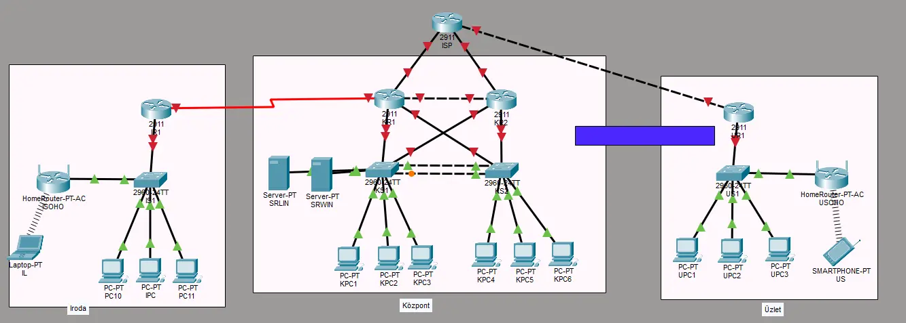

# Projekt terv - Lossó Bálint, Pásztor Dávid, Pintér Soma

**Topológia**

**Telephelyek**
- Központ
	- Feladata kiszolgálni a többi telephelyet, a folyamatos szolgáltatás elérés érdekében, 2. és 3. rétegbeli redundanciával rendelkezik.
	- A biztonságos WAN kapcsolat érdekében, minden telephely *tűzfallal* csatlakozik az *ISP* felé.
	- Az *ISP* felé történő, illetve az onnan befelé jövő kommunikáció *tűzfal*lal van védve, illetve a határforgalomirányítón *BGP* fut.
	- Az irodai és központi felhasználók bejelentkezését a *Windows Szerver* szolgálja ki.
	- A *Linux szerver*en *webszerver* fut, mely a *Windows Szerveren* futó *DNS*-en keresztül elérhető.
	- A Windows szerveren DHCP szolgáltatás is fut, mely kiszolgál IPv4 illetve IPv6 címeket egyaránt.
	- A forgalomirányítást OSPFv3-al oldottuk meg.
	- A szerverek ISP felé történő kommunikációjáért statikus címfordíást alkalmazunk, a többi kliens dinamikusan kapja a címet.
	- A központban található *VLAN*-ok:
		- HR **10**
		- Sales **20**
		- Marketing **30**
    	- Management **88**
		- Services **100**
- Iroda
	- Az éppen a cég által fejlesztett projektek, a központban elhelyezkedő *Linux szerver*en találhatók, melyek kizárólag *VPN* kapcsolaton keresztül érhetők el.
	- A rendszergazda számítógépén futtathatóak a Linux szerveren mentett konfigurációs fájlok, a hálózati eszközök automatizált konfigurációjára.
	- Az irodában található *VLAN*-ok:
		- HR **11**
		- Sales **22**
		- Marketing **33**
        - Management **88**
		- Blackhole **101**
	- A központi *Linux szerver*hez a hozzáférést *ACL* szabályozza.
- Üzlet
 	- Az üzletben a bankkártyás fizetés elérése érdekében *WI-FI* hálózat működik.
	- Az üzleti hálózat automatikus konfigurációval rendelkezik.
	- Az üzletben található *VLAN*-ok:
		- Guest
		- Desktop
	- Az ISP felé történő kommunikációhoz PAT-ot alkalmazunk.

**Windows Szerveren futó szolgáltatások**
- Active Directory, DNS, DHCP, Automatizált szoftvertelepítés, Webszerver

**Linux Szerveren futó szolgáltatások**
- Webszerver, FTP, Adatbázis, Automatizált mentés
